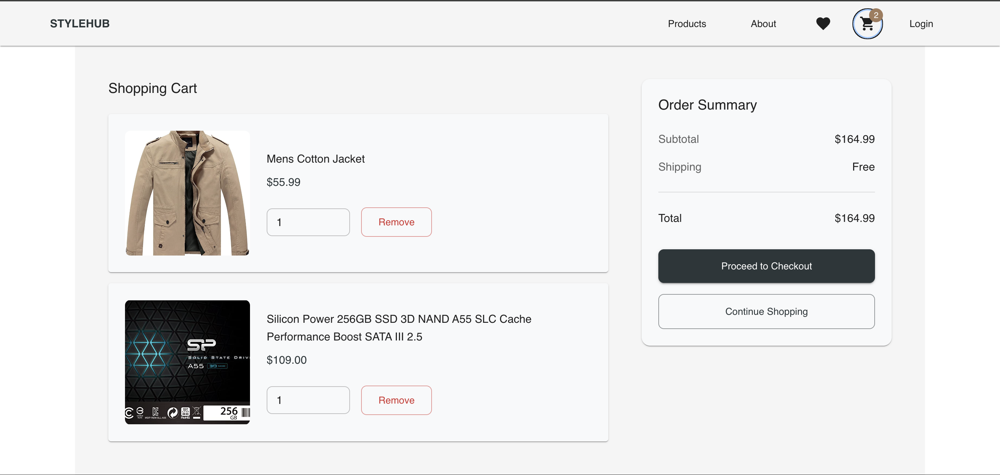
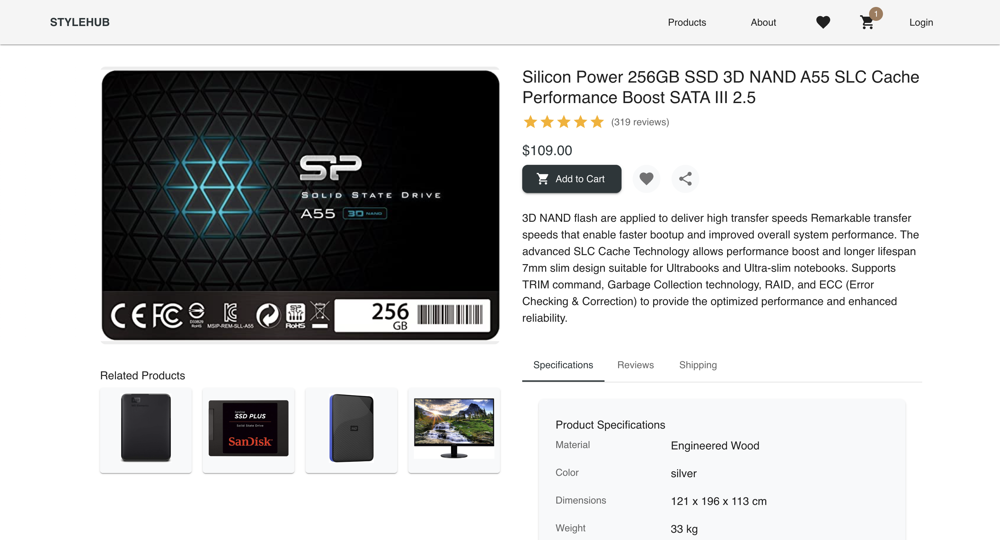

<div align="center">
  <h1>🏠 StyleHub</h1>
  <p>
    <strong>Modern Home Decor E-commerce Platform</strong>
  </p>
  
  <p>
    <a href="#features">Features</a> •
    <a href="#tech-stack">Tech Stack</a> •
    <a href="#getting-started">Getting Started</a> •
    <a href="#screenshots">Screenshots</a>
  </p>

  
</div>

<br/>

## ✨ Features

### 🛍️ Shopping Experience

#### Product Catalog
- Responsive grid layout with dynamic filtering
- Advanced sorting and category navigation
- Real-time search with instant results
- Detailed product views with specifications
- Related products recommendations

#### Shopping Cart
- Real-time cart updates and calculations
- Intuitive quantity management
- Comprehensive order summary
- Persistent cart state across sessions
- Secure checkout process with multiple payment options

#### User Features
- Seamless user authentication
- Personalized wishlist management
- Detailed order history tracking
- Customizable user profile settings

### 🎨 Design & UX

#### Modern Interface
- Clean, minimalist design language
- Fully responsive layout for all devices
- Smooth animations and transitions
- Intuitive navigation patterns
- Consistent visual hierarchy

#### Performance Optimization
- Lightning-fast loading times
- Optimized image delivery
- Efficient lazy loading
- Smart state management
- Reduced bundle size

## 🛠️ Tech Stack

<table>
  <tr>
    <td align="center" width="96">
      
    </td>
    <td align="center" width="96">
      
    </td>
    <td align="center" width="96">
      
    </td>
    <td align="center" width="96">
      
    </td>
    <td align="center" width="96">
      
    </td>
  </tr>
  <tr>
    <td align="center">React</td>
    <td align="center">TypeScript</td>
    <td align="center">Material-UI</td>
    <td align="center">Redux</td>
    <td align="center">Vite</td>
  </tr>
</table>

## 🚀 Getting Started

### Prerequisites
- Node.js (v14 or higher)
- npm (v6 or higher) or yarn (v1.22 or higher)
- Git

### Installation

1. **Clone the repository**
   ```bash
   git clone https://github.com/yourusername/stylehub.git
   cd stylehub
   ```

2. **Install dependencies**
   ```bash
   npm install
   # or
   yarn install
   ```

3. **Set up environment variables**
   ```bash
   cp .env.example .env
   # Edit .env with your configuration
   ```

4. **Start the development server**
   ```bash
   npm run dev
   # or
   yarn dev
   ```

The application will be available at `http://localhost:3000`

## 📱 Screenshots

<div align="center">
  
  
</div>

## 📁 Project Structure

```
src/
├── components/          # Reusable UI components
│   ├── common/         # Shared components (buttons, inputs, etc.)
│   ├── layout/         # Layout components (header, footer, etc.)
│   ├── product/        # Product-specific components
│   └── skeletons/      # Loading state components
├── features/           # Redux slices and feature logic
├── pages/             # Page components and routes
├── services/          # API and external service integrations
├── utils/             # Helper functions and utilities
├── hooks/             # Custom React hooks
├── styles/            # Global styles and theme
└── types/             # TypeScript type definitions
```

## 🤝 Contributing

1. Fork the repository
2. Create your feature branch (`git checkout -b feature/AmazingFeature`)
3. Commit your changes (`git commit -m 'Add some AmazingFeature'`)
4. Push to the branch (`git push origin feature/AmazingFeature`)
5. Open a Pull Request

## 📄 License

This project is licensed under the MIT License - see the [LICENSE](LICENSE) file for details.

## 👥 Authors

- **Solahudeen Abdulrahmon** - *Initial work* - [Salatech](https://github.com/salatech)

## 🙏 Acknowledgments

- Material-UI team for the amazing component library
- Framer Motion team for the animation library
- All contributors who have helped shape this project

## 📞 Support

For support, email solahudeenbabatunde@gmail.com or join our Slack channel.

---

<div align="center">
  Made with ❤️ by <a href="https://github.com/salatech">Solahudeen Abdulrahmon</a>
</div>
